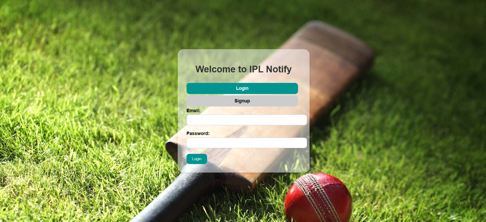
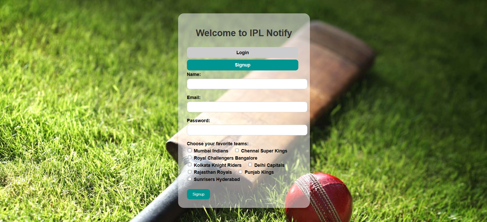
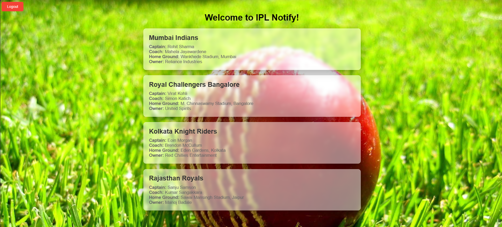
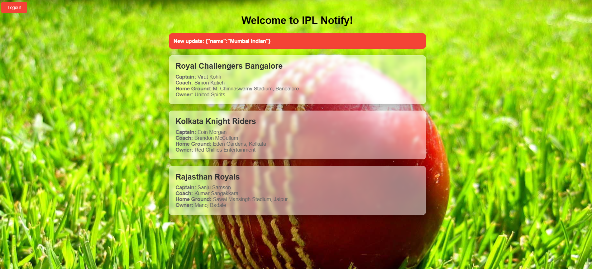

# IPL Notify

IPL Notify is a Node.js, Express.js, MongoDB, and Socket.io project designed to provide real-time updates on Indian Premier League (IPL) teams' data. Users can sign up, subscribe to their favorite teams, and receive notifications about updates made by admins.

## Technologies and Libraries Used

1. Node.js
2. Express.js
3. MongoDB/Mongoose
4. Socket.io
5. HTML/CSS
6. bcrypt
7. jsonwebtoken
8. Nodemon

## How to Use the Project

1. Clone this repository to your local machine from `https://github.com/gautamuniverse/iplnotify.git`
2. Run `npm install` to install all dependencies.
3. Make sure to add your MongoDB Url in the .env file present in the root directory.
3. Start the server by running either `nodemon index.js` or `node index.js`.

## Live Website

[IPL Notify](https://iplnotify.onrender.com)

## Admin Test Credentials
- email: gautam@gmail.com
- password: password

## Features

### User Management

- **Signup/Signin:** Users can signup or signin using their credentials.
- **Subscription:** During signup, users can select their favorite teams to subscribe to.

### User Interface

- **Homepage:** Authenticated users are redirected to the homepage where they can view subscribed teams' data.
- **Real-time Updates:** Users receive real-time updates on subscribed teams' data.

### Admin Privileges

- **Admin Role:** Admins have the privilege to update IPL teams' data.
- **Data Management:** Admins can add new data or update existing data related to IPL teams.

### Routes

- **User Routes:** `/user` handles user-related operations.
- **Homepage:** `/homepage` serves the homepage to authenticated users.
- **IPL Routes:** `/ipl` manages IPL-related operations.

### Server-Side Features

- **Middleware:** Jwt Authentication middleware secures protected routes.
- **Error Handling:** Custom error handler manages user-thrown and unhandled errors gracefully.
- **MVC Architecture:** Follows Model-View-Controller architecture for loose coupling, utilizing schemas, repository classes, and controllers.

### How to Read and Insert Data into IPL Database for Admin

Please refer to the instructions provided in the file [`How_To_Read_To_Insert_Data_Into_IPL_DB.txt`](How_To_Read_To_Insert_Data_Into_IPL_DB.txt) for detailed steps on reading and inserting data into the IPL database.

## Screenshots

1. Login Page:
   

2. Signup Page:
   

3. Homepage:
   

4. Notification:
   

## Contact Information

- **Author:** Gautam
- **GitHub:** [gautamuniverse](https://github.com/gautamuniverse)
- **LinkedIn:** [Gautam](https://www.linkedin.com/in/gautam-116307bb/)
- **Instagram:** [@gautamuniverse.in](https://www.instagram.com/gautamuniverse.in/)

## Contribution

Contributions are welcome! Feel free to open issues or submit pull requests.
